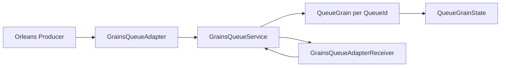
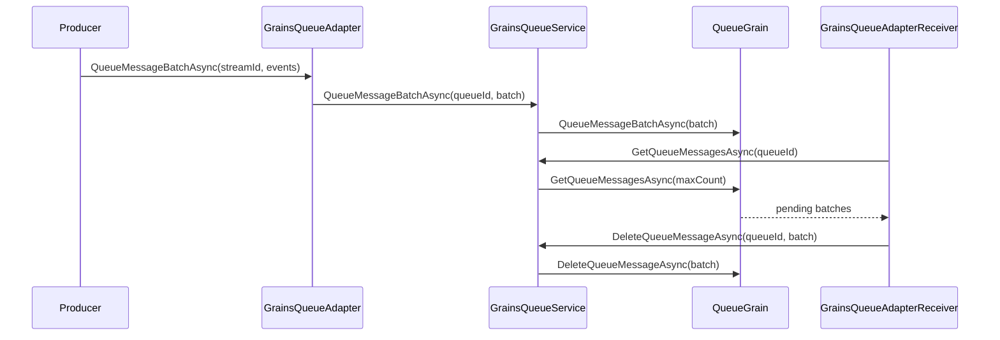

# Architektura

## Prehled komponent

## Tok zpravy

## Projekty a namespace mapa
| Projekt | Ucel | Namespace |
| --- | --- | --- |
| [Orleans.Streams.Grains.csproj](../Orleans.Streams.Grains/Orleans.Streams.Grains.csproj) | Produkcni knihovna stream provideru | `Orleans.Streams.Grains`, `Orleans.Streams.Grains.Hosting` |
| [Orleans.Streams.Grains.Tests.csproj](../Orleans.Streams.Grains.Tests/Orleans.Streams.Grains.Tests.csproj) | Test projekt (cluster fixture) | `Orleans.Streams.Grains.Tests` |

## Inbound/Outbound vazby v repozitari
- Inbound na knihovnu: [Orleans.Streams.Grains.Tests.csproj](../Orleans.Streams.Grains.Tests/Orleans.Streams.Grains.Tests.csproj) -> [Orleans.Streams.Grains.csproj](../Orleans.Streams.Grains/Orleans.Streams.Grains.csproj)
- Outbound interni projektove zavislosti: zadne dalsi `ProjectReference`.
- Outbound externi zavislosti: Orleans streaming stack a test stack (detaily v [tech.md](./tech.md)).

## Klicove moduly
- Core adapter: [GrainsQueueAdapter](../Orleans.Streams.Grains/GrainsQueueAdapter.cs), [GrainsQueueAdapterFactory](../Orleans.Streams.Grains/GrainsQueueAdapterFactory.cs), [GrainsQueueAdapterReceiver](../Orleans.Streams.Grains/GrainsQueueAdapterReceiver.cs)
- Queue storage grain: [IQueueGrain](../Orleans.Streams.Grains/IQueueGrain.cs), [QueueGrain](../Orleans.Streams.Grains/QueueGrain.cs), [QueueGrainState](../Orleans.Streams.Grains/QueueGrainState.cs)
- Konfigurace provideru: [GrainsStreamOptions](../Orleans.Streams.Grains/GrainsStreamOptions.cs), [GrainsStreamOptionsValidator](../Orleans.Streams.Grains/GrainsStreamOptionsValidator.cs), [GrainsStreamQueueMapper](../Orleans.Streams.Grains/GrainsStreamQueueMapper.cs)
- Hosting integrace: [Hosting/](../Orleans.Streams.Grains/Hosting/)

## Testovaci architektura (implementovano)
- Test helpery a data buildery: [TestHelpers](../Orleans.Streams.Grains.Tests/TestHelpers.cs)
- API/behavior testy:
  - [GrainsStreamOptionsValidatorTests](../Orleans.Streams.Grains.Tests/GrainsStreamOptionsValidatorTests.cs)
  - [GrainsStreamQueueMapperTests](../Orleans.Streams.Grains.Tests/GrainsStreamQueueMapperTests.cs)
  - [GrainsQueueBatchContainerTests](../Orleans.Streams.Grains.Tests/GrainsQueueBatchContainerTests.cs)
  - [GrainsQueueServiceTests](../Orleans.Streams.Grains.Tests/GrainsQueueServiceTests.cs)
  - [GrainsQueueAdapterTests](../Orleans.Streams.Grains.Tests/GrainsQueueAdapterTests.cs)
  - [GrainsQueueAdapterReceiverTests](../Orleans.Streams.Grains.Tests/GrainsQueueAdapterReceiverTests.cs)
  - [QueueGrainTests](../Orleans.Streams.Grains.Tests/QueueGrainTests.cs)
  - [HostingApiTests](../Orleans.Streams.Grains.Tests/HostingApiTests.cs)
  - [PublicApiModelTests](../Orleans.Streams.Grains.Tests/PublicApiModelTests.cs)
  - [SmokeTests](../Orleans.Streams.Grains.Tests/SmokeTests.cs)

## Poznamka k implementaci hostingu
- V konfiguratorech hostingu byly opraveny null guardy, aby validace argumentu probehla pred volanim bazoveho konstruktoru:
  - [SiloGrainsStreamConfigurator](../Orleans.Streams.Grains/Hosting/SiloGrainsStreamConfigurator.cs)
  - [ClusterClientGrainsStreamConfigurator](../Orleans.Streams.Grains/Hosting/ClusterClientGrainsStreamConfigurator.cs)

## Monorepo kontext
Git root je tento repozitar. Nejsou zjišteny dalsi interni projekty mimo dvojici produkcni knihovna + test projekt.
