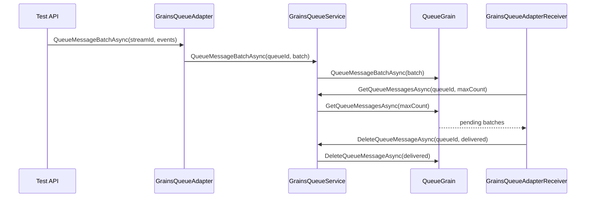

# Proposal: Kompletní API testy pro Orleans.Streams.Grains

## Cile
- Zavest testy, ktere pokryji hlavni verejne API knihovny `Orleans.Streams.Grains`.
- Zprovoznit test runner tak, aby `dotnet test` vracel realny vysledek (nenulovy pocet testu).
- Overit klicove chovani adapteru, receiveru, mapperu, validatoru a grainove fronty.

## Jira Kontext
- (bez tiketu)

## Pristupy (varianty)
### A) Ciste integracni testy nad Orleans TestCluster
- Plusy: maximalne verne realnemu provozu.
- Minusy: vysoka slozitost setupu, pomale behy, horsi diagnostika na jednotkove chyby.

### B) Ciste unit testy s mocky/substituty
- Plusy: rychle, izolovane, dobre lokalizuji chybu.
- Minusy: riziko, ze nektere integracni interakce Orleans hostingu zustanou netestovane.

### C) Hybrid (doporučeno)
- Jednotkove testy pro API kontrakty + behavior testy pro queue/grain logiku.
- Lehký integracni smoke test pres Orleans `TestCluster` pro stream provider registraci.
- Vyvazuje rychlost, stabilitu i realnou validaci integrace.

**Doporučení:** Varianta C.

## Scope
### In-scope
- `GrainsStreamOptionsValidator`, `GrainsStreamQueueMapper`, `GrainsQueueBatchContainer`
- `GrainsQueueAdapter`, `GrainsQueueAdapterReceiver`, `GrainsQueueService`
- `QueueGrain` (behavior s `IPersistentState` substitute)
- Hosting extension API (`AddGrainsStreams`) minimalne smoke + guard testy
- Oprava test projektu tak, aby testy byly discoverable a spustitelne

### Out-of-scope
- Zatezove/performance testy
- Distribuovane multi-silo scenare
- Zmeny verejneho API knihovny mimo nezbytne opravy pro testovatelnost

## Related Projects
- [Orleans.Streams.Grains](../../) - cilovy repozitar

## Data Flow

## Technicky Navrh
### Dotcene komponenty
- [Orleans.Streams.Grains.Tests](../../../Orleans.Streams.Grains.Tests/)
- Potencialne drobne opravy v [Orleans.Streams.Grains](../../../Orleans.Streams.Grains/) pokud testy odhali bug

### Technicky pristup
- Vytvorit test class per API oblast (Validator, Mapper, BatchContainer, Service, Receiver, QueueGrain, Hosting)
- Pouzit `NSubstitute` pro `IClusterClient`, `IPersistentState<T>`, logger factory a grain calls
- Pridat helpery pro konstrukci `StreamId`, `QueueId` a test batchi
- Zkontrolovat kompatibilitu xUnit runner balicku; pokud discovery nefunguje, sjednotit verze pro xUnit 2

### Integracni body
- Registrace provideru pres `ISiloBuilder.AddGrainsStreams(...)`
- Registrace provideru pres `IClientBuilder.AddGrainsStreams(...)`
- Volani `IGrainsQueueService` proti grain proxy

### Edge Cases & Error Handling
- Neplatna konfigurace (`MaxStreamNamespaceQueueCount < 1`, duplikat namespace, `QueueCount < 1`)
- `GetQueueForStream` pro neexistujici namespace
- `MessagesDeliveredAsync` s prazdnym vstupem nebo po shutdown
- Mazani zpravy, ktera neni v ocekavanem poradi

### Testing Strategy
- Red-Green-Refactor per test oblast
- Pred kazdou upravou produkcniho kodu nejdriv failing test
- Verifikace pres VS-MCP (`ExecuteAsyncTest`, `ExecuteCommand build`)

## Implementation Plan
1. Opravit test discovery/config (xUnit runner kompatibilita, minimalni smoke test).
2. Dopsat unit testy pro `GrainsStreamOptionsValidator` a `GrainsStreamQueueMapper`.
3. Dopsat unit testy pro `GrainsQueueBatchContainer`.
4. Dopsat unit testy pro `GrainsQueueService` a `GrainsQueueAdapter`.
5. Dopsat unit testy pro `GrainsQueueAdapterReceiver` (pending/finalize/delete tok).
6. Dopsat behavior testy pro `QueueGrain` vcetne dead-letter strategii.
7. Dopsat hosting API smoke/guard testy pro extension metody.
8. Spustit `build` + `test` ve VS-MCP a upravit kod dle failu.

## Verification Scope
- Testy maji potvrdit, ze verejne API je volatelne a vraci ocekavane chovani.
- `dotnet test`/VS test run musi reportovat nenulovy pocet testu.
- Build bez chyb a warningu.

## Risk Assessment
### risk_score: 2
- +1 API/contract verification scope je siroky
- +1 scope pres vice modulu knihovny

### execution_mode: Light

## Success Criteria
- V test projektu je sada automatickych testu pokryvajicich hlavni verejne API.
- Test runner detekuje a provadi testy (Total > 0).
- Build i test run prochazi v aktualnim repozitari.
