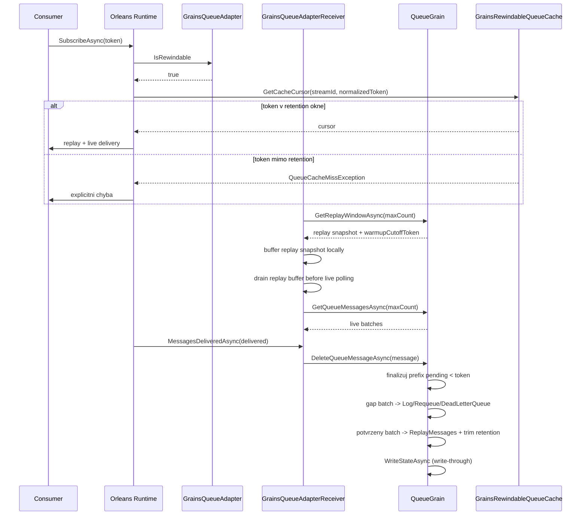

# Proposal: Rewindable chovani pro GrainsQueueStorage provider

## Cile
- Umoznit rewindable subscribe/resume v provideru `GrainsQueueStorage`.
- Garantovat rewind okno poslednich `ReplayRetentionBatchCount` potvrzenych batchi na queue.
- Pri token miss vracet explicitni chybu (zadny silent fallback na live tail).
- Dodat plnou rewind funkcionalitu bez feature flagu a bez postupne migrace.

## Rozhodnuti
- Vybrana varianta: **B) bounded durable rewind uvnitr provideru**.
- Rewind kontrakt: **garantovane v retention okne**.
- Retention politika: **count-based**.
- Vychozi hodnota: **`ReplayRetentionBatchCount = 1000` na queue**.
- Execution mode: **Strict**.

## Jira Kontext
- (bez tiketu)

## Soucasny stav v projektu
- Adapter je dnes nerewindable: [GrainsQueueAdapter](../../../Orleans.Streams.Grains/GrainsQueueAdapter.cs)
- Provider pouziva `SimpleQueueAdapterCache`: [GrainsQueueAdapterFactory](../../../Orleans.Streams.Grains/GrainsQueueAdapterFactory.cs)
- Queue state nema replay buffer: [QueueGrainState](../../../Orleans.Streams.Grains/QueueGrainState.cs)
- Per-operacni persistence dnes neni: [QueueGrain](../../../Orleans.Streams.Grains/QueueGrain.cs)

## Rewind Contract
### Token granularita
- Provider garantuje rewind na **batch-level**.
- Pro `EventSequenceTokenV2(sequence, eventIndex > 0)` se token normalizuje na zacatek batch (`eventIndex=0`).
- Duledek: pri resume od tokenu uvnitr batch muze dojit k redelivery casti eventu v te same batchi; je to explicitne podporovany contract.

### Cursor semantics
- `null` token = od aktualniho konce (tail).
- `token` v retention okne = resume od dalsiho dostupneho batch offsetu >= token-batch-boundary.
- `token` mimo retention okno = `QueueCacheMissException(requested, low, high)` (`DataNotAvailableException` je base type), bez fallbacku na live tail.

## Scope
### In-scope
- Rewindable provider contract.
- Replay retention v persisted queue grain state.
- Deterministicky ack/delete-by-token flow.
- Token-aware queue cache + warmup lifecycle.
- Observability pro rewind/token miss.
- Unit + integracni testy.

### Out-of-scope
- Externi replay storage.
- Zmeny mimo `Orleans.Streams.Grains` a `Orleans.Streams.Grains.Tests`.

## Related Projects
- [Orleans.Streams.Grains Memory Bank](../../)

## Data Flow

## Technicky Navrh
### Konfigurace
- [GrainsStreamOptions](../../../Orleans.Streams.Grains/GrainsStreamOptions.cs)
  - `ReplayRetentionBatchCount` (int, default `1000`, min `1`)
- [GrainsStreamOptionsValidator](../../../Orleans.Streams.Grains/GrainsStreamOptionsValidator.cs)
  - validace `ReplayRetentionBatchCount`.

### Adapter a cache
- [GrainsQueueAdapter](../../../Orleans.Streams.Grains/GrainsQueueAdapter.cs)
  - `IsRewindable` je `true`.
- [GrainsQueueAdapterFactory](../../../Orleans.Streams.Grains/GrainsQueueAdapterFactory.cs)
  - nahradit `SimpleQueueAdapterCache` za custom `GrainsRewindableQueueAdapterCache`.
- Nova cache vrstva
  - `GrainsRewindableQueueAdapterCache : IQueueAdapterCache`
  - `GrainsRewindableQueueCache : IQueueCache`
  - drzi poslednich N batchi (N = `ReplayRetentionBatchCount`) bez zavislosti na purge heuristikach.

### Warmup lifecycle hook (explicitne)
- Warmup se provede v [GrainsQueueAdapterReceiver.Initialize](../../../Orleans.Streams.Grains/GrainsQueueAdapterReceiver.cs):
  - receiver nacte snapshot replay window z queue grainu pres service API v jedne atomic call,
  - grain vrati replay snapshot spolu s `warmupCutoffToken`,
  - receiver bufferuje snapshot lokalne a vrati ho driv nez live data,
  - cache se tim naplni pred beznym live stream tokem.
- Pokud atomic warmup call selze, receiver neprepne do partial replay/live merge; init failne.
- `CreateQueueCache(...)` nema side-effect I/O; pouze vytvori in-memory cache instanci.
- `GetQueueMessagesAsync` v warmup fazi nikdy nemicha replay snapshot a live read v jednom volani.
- Live batches s tokenem `<= warmupCutoffToken` se povazuji za duplicitni a jsou dropnuty jako ochranna brzda.

### Warmup boundary
- `warmupCutoffToken` je nejvyssi batch token obsazeny v atomickem replay snapshotu.
- Snapshot a cutoff token musi vzniknout v jednom grain turnu, aby mezi nimi nevzniklo okno pro duplicity nebo mezery.
- Receiver zacne live polling az po vycerpani lokalniho replay bufferu.
- Toto je jediny merge model: zadne dual-read slucovani mezi replay a live.

### Queue grain kontrakt
- **Nemenit signaturu** `DeleteQueueMessageAsync(GrainsQueueBatchContainer message)` v [IQueueGrain](../../../Orleans.Streams.Grains/IQueueGrain.cs).
- Rozsireni je aditivni:
  - pridat cteni replay windowu (`GetReplayWindowAsync(int maxCount)`), vracejici replay snapshot + `warmupCutoffToken`.
  - novy RPC i nove DTO maji vlastni aliasy; existujici aliasy zustavaji beze zmeny.
  - `DeleteQueueMessageAsync` interne finalizuje podle `message.SequenceToken` (token-driven), ale API zustava kompatibilni.
- Deployment predpoklada jednu verzi v clusteru; mixed-version fallback neni soucasti navrhu.

### Prefix finalize algorithm
- Invarianty:
  - `Messages` = batchy cekajici na read.
  - `PendingMessages` = batchy predane runtime, cekajici na finalizaci.
  - `ReplayMessages` = potvrzene batchy v retention okne, od nejstarsiho k nejnovejsimu.
- `DeleteQueueMessageAsync(message)` pracuje s `target = normalize(message.SequenceToken)`:
  - pro `EventSequenceTokenV2(sequence, eventIndex > 0)` se token pred porovnanim snizi na `eventIndex = 0`,
  - grain porovnava batch-level tokeny, ne event-level offsety.
- Postup:
  1. pokud je `PendingMessages` prazdna, vratit no-op,
  2. pokud je head `PendingMessages` novejsi nez `target`, vratit no-op,
  3. dokud je head `PendingMessages` starsi nez `target`, finalizovat ho jako gap:
     - `Log` -> warning a drop,
     - `Requeue` -> enqueue do `Messages`,
     - `DeadLetterQueue` -> enqueue do `DroppedMessages`,
  4. kdyz head token odpovida `target`, odebrat ho z `PendingMessages`,
  5. tento batch pridat do `ReplayMessages` jen tehdy, kdyz jde o potvrzeny batch,
  6. `ReplayMessages` trimnout na `ReplayRetentionBatchCount`,
  7. zapsat stav jednim `WriteStateAsync()`,
  8. opakovany delete stejneho tokenu musi byt no-op.
- Skippnute gap batchy se nikdy nepridavaji do `ReplayMessages`.
- `ReplayMessages` je append-only potvrzeny buffer; starsi batche se odrezavaji z headu.
- Algorithm musi byt idempotentni i pri out-of-order doruceni delete requestu.

### Durability garance
- Write-through: po uspesne finalize mutaci se vola `WriteStateAsync` v te same operaci.
- Akceptovany loss window: pouze neukoncene/faultnute operace.
- Po restartu je rewind window obnoveno z persisted `ReplayMessages`.

### Observability
- Warning log pri token miss (`requested`, `low`, `high`, `queueId`, `providerName`).
- Source metrik:
  - `GetReplayWindowAsync` -> `rewind_requests_total` a `replay_warmup_batches_loaded`
  - `GrainsRewindableQueueCache.GetCacheCursor` -> `rewind_token_miss_total`
  - `GrainsQueueAdapterReceiver.Initialize` -> `replay_warmup_latency_ms`
  - `QueueGrain.DeleteQueueMessageAsync` -> `replay_finalize_latency_ms`
- Jednotky:
  - `count` pro countery
  - `ms` pro histogramy
  - `items` pro `ReplayMessagesCount` / `replay_buffer_size`
- Rozsirit [QueueStatus](../../../Orleans.Streams.Grains/QueueStatus.cs) o `ReplayMessagesCount`.

### Performance a degradace
- Gate pred mergem:
  - p95 latence `DeleteQueueMessageAsync` <= 50 ms pri 200 batch/s na queue,
  - warmup snapshot load bez storage throttling alertu,
  - 60s soak s `GetQueueStatusAsync` sampling po 5 s.

### Kompatibilita
- Zadne datove migrace.
- Zadne postupne prepinani verzi.
- Novy RPC a DTO jsou aditivni; existujici aliasy zustavaji beze zmeny.
- Rewind path je jedina implementace v provozu; zadny runtime fallback na legacy.

## Implementation Plan
1. Rozsirit `GrainsStreamOptions` + validator (`ReplayRetentionBatchCount`).
2. Rozsirit `QueueGrainState` o `ReplayMessages`.
3. Rozsirit `IQueueGrain`/service o replay window API (`GetReplayWindowAsync`) a aditivni DTO.
4. Implementovat prefix-finalizer v `QueueGrain`: gap handling podle strategie, target batch do `ReplayMessages`, idempotence, write-through.
5. Implementovat custom rewindable queue cache (`IQueueAdapterCache`/`IQueueCache`) s retention limitem.
6. Implementovat warmup v `GrainsQueueAdapterReceiver.Initialize` jako jednorazovy atomic snapshot + cutoff token, live az po vycerpani lokalniho bufferu.
7. Napojit `GrainsQueueAdapter.IsRewindable` a receiver/cache na rewindable path bez feature flagu.
8. Dopsat observability + `QueueStatus` rozsireni.
9. Dopsat testy:
   - unit: prefix finalization, gap handling, duplicate delete no-op, replay trim, token normalization.
   - integration (TestCluster): subscribe/resume token, token miss, rewind miss, warmup boundary under concurrent enqueue, restart/deaktivace, full-path smoke test.
10. Spustit build + test gate, vyhodnotit performance gate.

## Verification Scope
- `GrainsQueueAdapter.IsRewindable` je true a provider vraci rewind path bez feature flagu.
- Token `eventIndex > 0` je predikovatelne normalizovan na batch-level.
- `DeleteQueueMessageAsync` finalizuje prefix `PendingMessages` podle tokenu a je idempotentni.
- Warmup snapshot se nacte atomicky v jedne call, live polling startuje az po vycerpani lokalniho replay bufferu.
- Concurrent enqueue behem warmupu neprodukuje duplicity ani mezery.
- Gap batchy jdou pres existujici strategii, potvrzeny batch jde do `ReplayMessages`.
- `GetReplayWindowAsync` vraci snapshot + `warmupCutoffToken` v jednom grain turnu.
- Token v retention okne replayuje data; mimo okno vraci `QueueCacheMissException`.
- `QueueStatus.ReplayMessagesCount` odpovida persisted replay bufferu.
- Build + test + integracni testy prochazi.

## Risk Assessment
### risk_score: 3
- +1 API/contract zmena
- +1 persistent state schema change
- +1 multi-modulovy zasah

### execution_mode: Strict

## Success Criteria
- Provider je rewindable a plni definovany batch-level rewind contract.
- Replay retention je persistentni v rozsahu `ReplayRetentionBatchCount`.
- Token miss je explicitne signalizovan a observovatelny.
- Build + test + integracni gate jsou zelene.
