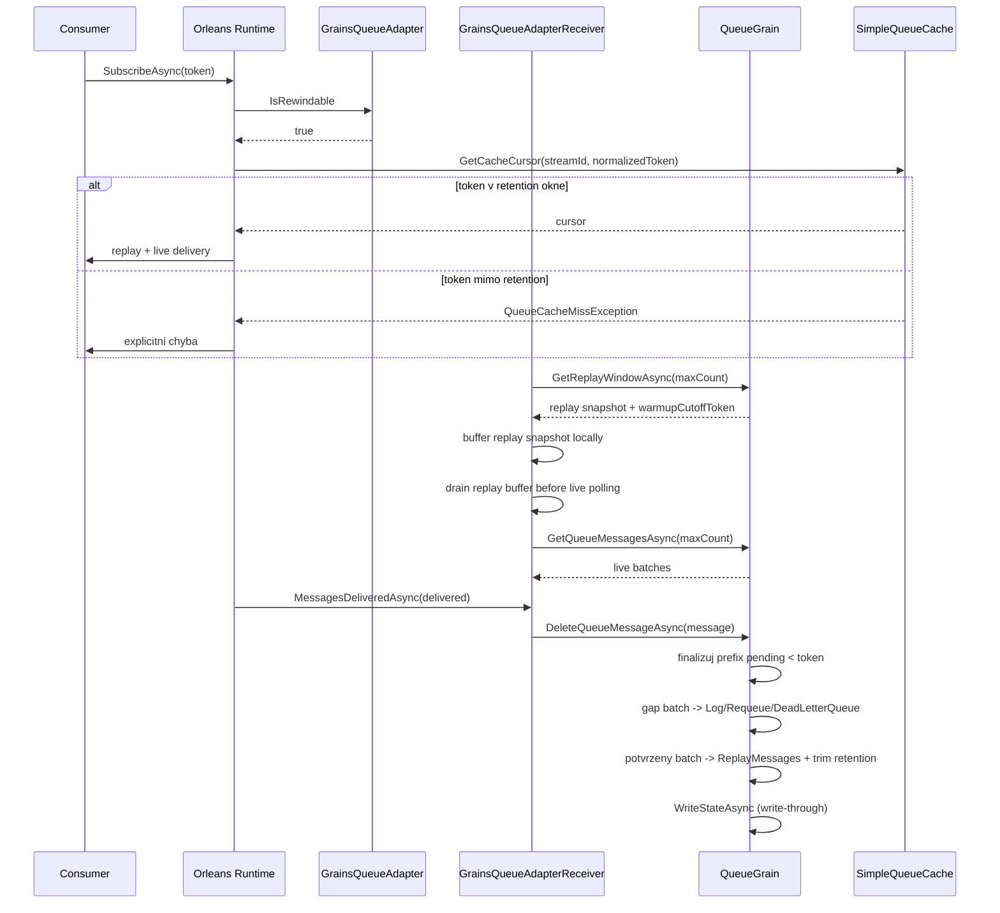

# Proposal: Rewindable chovani pro GrainsQueueStorage provider

## Cile
- Umoznit rewindable subscribe/resume v provideru `GrainsQueueStorage`.
- Garantovat rewind okno poslednich `ReplayRetentionBatchCount` potvrzenych batchi na queue.
- Pri token miss vracet explicitni chybu (zadny silent fallback na live tail).
- Dodat plnou rewind funkcionalitu bez feature flagu a bez postupne migrace.

## Rozhodnuti
- Vybrana varianta: **B) bounded durable rewind uvnitr provideru**.
- Rewind kontrakt: **garantovane v retention okne**.
- Retention politika: **count-based**.
- Vychozi hodnota: **`ReplayRetentionBatchCount = 1000` na queue**.
- Execution mode: **Strict**.

## Jira Kontext
- (bez tiketu)

## Soucasny stav po implementaci
- Provider je prepnuty na rewindable path (`IsRewindable=true`) a pouziva Orleans cache:
  - [GrainsQueueAdapter](../../../Orleans.Streams.Grains/GrainsQueueAdapter.cs)
  - [GrainsQueueAdapterFactory](../../../Orleans.Streams.Grains/GrainsQueueAdapterFactory.cs)
  - [SimpleQueueAdapterCache](../../../../orleans/src/Orleans.Streaming/Common/SimpleCache/SimpleQueueAdapterCache.cs)
- Queue grain drzi replay buffer a expose replay API:
  - [QueueGrain](../../../Orleans.Streams.Grains/QueueGrain.cs)
  - [QueueGrainState](../../../Orleans.Streams.Grains/QueueGrainState.cs)
  - [GrainsQueueReplayWindow](../../../Orleans.Streams.Grains/GrainsQueueReplayWindow.cs)

## Zjistene problemy z review (2026-04-12)
- **Kriticky:** `GrainsRewindableQueueCache.TryPurgeFromCache` je trvale `false` a `IsUnderPressure` vraci `true` pri naplneni retention, cteni se muze zastavit:
  - [GrainsRewindableQueueCache](../../../Orleans.Streams.Grains/GrainsRewindableQueueCache.cs)
  - [PersistentStreamPullingAgent](../../../../orleans/src/Orleans.Streaming/PersistentStreams/PersistentStreamPullingAgent.cs)
- **Kriticky:** cursor semantika custom cache neni kompatibilni s Orleans (`MoveNext`/`Refresh`/enumerator pattern), hrozi ztrata nebo reorder doruceni:
  - [GrainsRewindableQueueCache](../../../Orleans.Streams.Grains/GrainsRewindableQueueCache.cs)
  - [SimpleQueueCacheCursor](../../../../orleans/src/Orleans.Streaming/Common/SimpleCache/SimpleQueueCacheCursor.cs)
- **Vysoky dopad:** `GetReplayWindowAsync` vraci nejstarsi cast retenze (`Take(maxCount)`), receiver warmup je hard-cap 32 a retention ma 2 zdroje pravdy (`GrainsStreamOptions` vs `GrainsQueueOptions`):
  - [QueueGrain](../../../Orleans.Streams.Grains/QueueGrain.cs)
  - [GrainsQueueAdapterReceiver](../../../Orleans.Streams.Grains/GrainsQueueAdapterReceiver.cs)
  - [GrainsStreamOptions](../../../Orleans.Streams.Grains/GrainsStreamOptions.cs)
  - [GrainsQueueOptions](../../../Orleans.Streams.Grains/GrainsQueueOptions.cs)
- **Stredni dopad:** integracni test deaktivace/reaktivace je flaky (timeout):
  - [GrainsStreamIntegrationTests](../../../Orleans.Streams.Grains.Tests/GrainsStreamIntegrationTests.cs)

## Varianty opravy
- **A) Dopracovat custom cache do plne parity se `SimpleQueueCache`**
  - Plus: zachova se aktualni vlastni vrstva.
  - Minus: vysoke riziko regressi v cursor/purge/pressure semantice.
- **B) Vratit runtime cache na Orleans `SimpleQueueAdapterCache`, rewind drzet v grain replay state (doporučeno)**
  - Plus: jedna semantika kompatibilni s Orleans, mensi maintenance, mensi riziko.
  - Minus: nutne premapovat retention konfiguraci a odstranit custom cache kod.
- **C) Hybrid (custom cache + feature flag fallback na Simple)**
  - Plus: postupny rollout.
  - Minus: 2 cesty kodu, vyssi slozitost a proti cilu "jeden zdroj pravdy".

## Doporucene rozhodnuti
- Vybrana varianta: **B) Orleans `SimpleQueueAdapterCache` + grain replay retention jako jediny zdroj pravdy**.
- Duvod: maximalni kompatibilita se semantikou Orleans a nejmensi produkcni riziko.

## Doporuceni pri pochybnostech
- Pokud bude implementace nebo testy nejednoznacne, prednostne overit semantiku v oficialnich Orleans zdrojacich:
  - [Orleans zdrojaky](../../../../orleans/)
- Referencni body:
  - [SimpleQueueCache](../../../../orleans/src/Orleans.Streaming/Common/SimpleCache/SimpleQueueCache.cs)
  - [SimpleQueueCacheCursor](../../../../orleans/src/Orleans.Streaming/Common/SimpleCache/SimpleQueueCacheCursor.cs)
  - [PersistentStreamPullingAgent](../../../../orleans/src/Orleans.Streaming/PersistentStreams/PersistentStreamPullingAgent.cs)
  - [QueueCacheMissException](../../../../orleans/src/Orleans.Streaming/QueueAdapters/QueueCacheMissException.cs)

## Rewind Contract
### Token granularita
- Provider garantuje rewind na **batch-level**.
- Pro `EventSequenceTokenV2(sequence, eventIndex > 0)` se token normalizuje na zacatek batch (`eventIndex=0`).
- Duledek: pri resume od tokenu uvnitr batch muze dojit k redelivery casti eventu v te same batchi; je to explicitne podporovany contract.

### Cursor semantics
- `null` token = od aktualniho konce (tail).
- `token` v retention okne = resume od dalsiho dostupneho batch offsetu >= token-batch-boundary.
- `token` mimo retention okno = `QueueCacheMissException(requested, low, high)` (`DataNotAvailableException` je base type), bez fallbacku na live tail.

## Scope
### In-scope
- Rewindable provider contract.
- Replay retention v persisted queue grain state.
- Deterministicky ack/delete-by-token flow.
- Token-aware queue cache + warmup lifecycle.
- Observability pro rewind/token miss.
- Unit + integracni testy.

### Out-of-scope
- Externi replay storage.
- Zmeny mimo `Orleans.Streams.Grains` a `Orleans.Streams.Grains.Tests`.

## Related Projects
- [Orleans.Streams.Grains Memory Bank](../../)

## Data Flow

## Technicky Navrh
### Konfigurace
- [GrainsStreamOptions](../../../Orleans.Streams.Grains/GrainsStreamOptions.cs)
  - `ReplayRetentionBatchCount` (int, default `1000`, min `1`)
- [GrainsStreamOptionsValidator](../../../Orleans.Streams.Grains/GrainsStreamOptionsValidator.cs)
  - validace `ReplayRetentionBatchCount`.

### Adapter a cache
- [GrainsQueueAdapter](../../../Orleans.Streams.Grains/GrainsQueueAdapter.cs)
  - `IsRewindable` je `true`.
- [GrainsQueueAdapterFactory](../../../Orleans.Streams.Grains/GrainsQueueAdapterFactory.cs)
  - cilovy stav je Orleans `SimpleQueueAdapterCache`.
  - `SimpleQueueCacheOptions.CacheSize` musi byt zarovnane s `ReplayRetentionBatchCount`, aby warmup+live cache drzely stejny retention budget.

### Warmup lifecycle hook (explicitne)
- Warmup se provede v [GrainsQueueAdapterReceiver.Initialize](../../../Orleans.Streams.Grains/GrainsQueueAdapterReceiver.cs):
  - receiver nacte snapshot replay window z queue grainu pres service API v jedne atomic call,
  - grain vrati replay snapshot spolu s `warmupCutoffToken`,
  - receiver bufferuje snapshot lokalne a vrati ho driv nez live data,
  - cache se tim naplni pred beznym live stream tokem.
- Pokud atomic warmup call selze, receiver neprepne do partial replay/live merge; init failne.
- `CreateQueueCache(...)` nema side-effect I/O; pouze vytvori in-memory cache instanci.
- `GetQueueMessagesAsync` v warmup fazi nikdy nemicha replay snapshot a live read v jednom volani.
- Live batches s tokenem `<= warmupCutoffToken` se povazuji za duplicitni a jsou dropnuty jako ochranna brzda.

### Warmup boundary
- `warmupCutoffToken` je nejvyssi batch token obsazeny v atomickem replay snapshotu.
- Snapshot a cutoff token musi vzniknout v jednom grain turnu, aby mezi nimi nevzniklo okno pro duplicity nebo mezery.
- Receiver zacne live polling az po vycerpani lokalniho replay bufferu.
- Toto je jediny merge model: zadne dual-read slucovani mezi replay a live.

### Queue grain kontrakt
- **Nemenit signaturu** `DeleteQueueMessageAsync(GrainsQueueBatchContainer message)` v [IQueueGrain](../../../Orleans.Streams.Grains/IQueueGrain.cs).
- Rozsireni je aditivni:
  - pridat cteni replay windowu (`GetReplayWindowAsync(int maxCount)`), vracejici replay snapshot + `warmupCutoffToken`.
  - novy RPC i nove DTO maji vlastni aliasy; existujici aliasy zustavaji beze zmeny.
  - `DeleteQueueMessageAsync` interne finalizuje podle `message.SequenceToken` (token-driven), ale API zustava kompatibilni.
- Deployment predpoklada jednu verzi v clusteru; mixed-version fallback neni soucasti navrhu.

### Prefix finalize algorithm
- Invarianty:
  - `Messages` = batchy cekajici na read.
  - `PendingMessages` = batchy predane runtime, cekajici na finalizaci.
  - `ReplayMessages` = potvrzene batchy v retention okne, od nejstarsiho k nejnovejsimu.
- `DeleteQueueMessageAsync(message)` pracuje s `target = normalize(message.SequenceToken)`:
  - pro `EventSequenceTokenV2(sequence, eventIndex > 0)` se token pred porovnanim snizi na `eventIndex = 0`,
  - grain porovnava batch-level tokeny, ne event-level offsety.
- Postup:
  1. pokud je `PendingMessages` prazdna, vratit no-op,
  2. pokud je head `PendingMessages` novejsi nez `target`, vratit no-op,
  3. dokud je head `PendingMessages` starsi nez `target`, finalizovat ho jako gap:
     - `Log` -> warning a drop,
     - `Requeue` -> enqueue do `Messages`,
     - `DeadLetterQueue` -> enqueue do `DroppedMessages`,
  4. kdyz head token odpovida `target`, odebrat ho z `PendingMessages`,
  5. tento batch pridat do `ReplayMessages` jen tehdy, kdyz jde o potvrzeny batch,
  6. `ReplayMessages` trimnout na `ReplayRetentionBatchCount`,
  7. zapsat stav jednim `WriteStateAsync()`,
  8. opakovany delete stejneho tokenu musi byt no-op.
- Skippnute gap batchy se nikdy nepridavaji do `ReplayMessages`.
- `ReplayMessages` je append-only potvrzeny buffer; starsi batche se odrezavaji z headu.
- Algorithm musi byt idempotentni i pri out-of-order doruceni delete requestu.

### Durability garance
- Write-through: po uspesne finalize mutaci se vola `WriteStateAsync` v te same operaci.
- Akceptovany loss window: pouze neukoncene/faultnute operace.
- Po restartu je rewind window obnoveno z persisted `ReplayMessages`.

### Observability
- Warning log pri token miss (`requested`, `low`, `high`, `queueId`, `providerName`).
- Source metrik:
  - `GetReplayWindowAsync` -> `rewind_requests_total` a `replay_warmup_batches_loaded`
  - cache miss path (`QueueCacheMissException`) -> `rewind_token_miss_total`
  - `GrainsQueueAdapterReceiver.Initialize` -> `replay_warmup_latency_ms`
  - `QueueGrain.DeleteQueueMessageAsync` -> `replay_finalize_latency_ms`
- Jednotky:
  - `count` pro countery
  - `ms` pro histogramy
  - `items` pro `ReplayMessagesCount` / `replay_buffer_size`
- Rozsirit [QueueStatus](../../../Orleans.Streams.Grains/QueueStatus.cs) o `ReplayMessagesCount`.

### Performance a degradace
- Gate pred mergem:
  - p95 latence `DeleteQueueMessageAsync` <= 50 ms pri 200 batch/s na queue,
  - warmup snapshot load bez storage throttling alertu,
  - 60s soak s `GetQueueStatusAsync` sampling po 5 s.

### Kompatibilita
- Zadne datove migrace.
- Zadne postupne prepinani verzi.
- Novy RPC a DTO jsou aditivni; existujici aliasy zustavaji beze zmeny.
- Rewind path je jedina implementace v provozu; zadny runtime fallback na legacy.

## Implementation Plan
- [x] **Krok 1: Sjednotit source-of-truth pro replay retention (`GrainsStreamOptions`)**
  - Propagovat `ReplayRetentionBatchCount` do vsech mist, kde ho potrebuje grain i receiver.
  - Odstranit drift mezi `GrainsStreamOptions` a `GrainsQueueOptions`.
  - Commit: `@mb_git_commit` po zelenych unit testech konfigurace.
- [x] **Krok 2: Opravit `QueueGrain.GetReplayWindowAsync` semantiku**
  - Vracet **poslednich N batchi retention okna** (ne nejstarsi), zachovat deterministicke poradi pro warmup.
  - `WarmupCutoffToken` musi byt nejvyssi token ve vracenem okne.
  - Commit: `@mb_git_commit` po zelenych testech replay window.
- [x] **Krok 3: Nahradit custom cache Orleans kompatibilni cestou**
  - Vratit `GrainsQueueAdapterFactory` na `SimpleQueueAdapterCache` a odstranit custom rewindable cache tridu.
  - Zarovnat `SimpleQueueCacheOptions.CacheSize` s `ReplayRetentionBatchCount`.
  - Cilem je kompatibilni `MoveNext`/`Refresh`/purge/backpressure semantika bez vlastni reimplementace cache.
  - Commit: `@mb_git_commit` po zelenych cache/adapter testech.
- [x] **Krok 4: Opravit warmup lifecycle receiveru**
  - Warmup call nesmi byt natvrdo 32; musi reflektovat retenzni cil.
  - Zajistit replay-before-live a robustni deduplikaci proti `warmupCutoffToken`.
  - Commit: `@mb_git_commit` po zelenych receiver testech.
- [x] **Krok 5: Stabilizovat a rozsirit verifikaci**
  - Opravit flaky test deaktivace/reaktivace.
  - Dopsat scenar Oracle semantiky pro cursor handshake (`GetCacheCursor` + `MoveNext`) a test paralelnich writer/reader zatezi.
  - Commit: `@mb_git_commit` po zelenych integracnich testech.
- [x] **Krok 6: Finalni gate a evidence**
  - Spustit `dotnet build` + `dotnet test` celeho solution.
  - Zapsat vysledky do `memory-bank/context.md` a potvrdit pripravenost na `@mb_act`.
  - Commit: `@mb_git_commit` s finalnim shrnutim.

## Realizace (mb-act 2026-04-12)
- `b6f4695` - odvozeni queue retention z `GrainsStreamOptions` v silo konfiguratoru.
- `9eecadd` - `GetReplayWindowAsync` vraci newest retention window + unit testy.
- `bb28392` - navrat na Orleans `SimpleQueueAdapterCache`, odstraneni custom cache kodu.
- `484c4d2` - receiver warmup/live batch count ridi replay retention (zadny hard-cap 32).
- `a5186d3` - stabilizace lifecycle integračního testu a verifikace cache-size alignment.

## Verification Scope
- **Orleans kompatibilita cache/cursor:**
  - `GetCacheCursor(streamId, null)` zacina na newest tokenu.
  - prvni `MoveNext()` vraci aktualni batch (enumerator pattern).
  - `Refresh(token)` nerepozicuje aktivni cursor mimo Orleans kontrakt.
  - `QueueCacheMissException` v pripade tokenu mimo retention (bez fallbacku na live tail).
- **Replay window/warmup:**
  - `GetReplayWindowAsync` vraci poslednich `ReplayRetentionBatchCount` potvrzenych batchi.
  - `WarmupCutoffToken` je nejvyssi token replay snapshotu.
  - warmup je replay-first, live duplicate batches (`<= cutoff`) se nedorucuji.
- **Queue finalize flow:**
  - `DeleteQueueMessageAsync` je idempotentni a zachovava gap strategii.
  - `ReplayMessagesCount` v `QueueStatus` odpovida persisted stavu po finalize.
- **Integrace a zatez:**
  - concurrent writer/reader testy pro ruzne kombinace producer/consumer count.
  - deaktivace/reaktivace grainu bez timeoutu a se zachovanim replay/status stavu.
- **Gate:**
  - `dotnet build Orleans.Streams.Grains.slnx -c Release`
  - `dotnet test Orleans.Streams.Grains.slnx -c Release`

## Risk Assessment
### risk_score: 3
- +1 API/contract korekce v runtime semantice (cursor/warmup/replay)
- +1 data correction v replay chovani (okno + cutoff semantika)
- +1 multi-modulovy zasah (adapter, receiver, grain, hosting, testy)

### execution_mode: Strict

## Success Criteria
- Runtime je kompatibilni se semantikou Orleans stream cache/cursor.
- Replay retention je ridena jednim zdrojem pravdy a warmup vraci spravne posledni okno.
- Zadne zamrzani cteni kvuli trvale backpressure situaci.
- Build + test + integracni gate jsou zelene, vcetne testu deactivate/reactivate.
