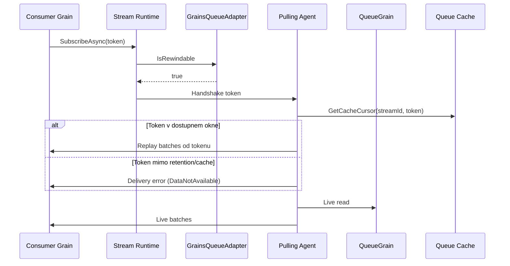

# Proposal: Rewindable chovani pro GrainsQueueStorage provider

## Cile
- Umoznit, aby provider `GrainsQueueStorage` vystupoval jako rewindable stream provider.
- Zachovat kompatibilitu se soucasnym provozem, kde consumeri ctou live data.
- Jasne definovat, co presne znamena rewind v tomto provideru (okno, fallback, chyby).

## Rozhodnuti
- Vybrana varianta: **B) Bounded durable rewind uvnitr provideru**.
- Stav: potvrzeno uzivatelem dne 2026-04-12.
- Rewind kontrakt: **garantovane v retention okne** (mimo okno explicitni chyba, bez ticheho fallbacku na live tail).
- Retention politika: **podle poctu batchi** (count-based).
- Vychozi hodnota retention: **`ReplayRetentionBatchCount = 1000` na queue**.

## Jira Kontext
- (bez tiketu)

## Nastudovane chovani rewindable streamu (Orleans)
- `IStreamProvider.IsRewindable`/`IQueueAdapter.IsRewindable` urcuje, jestli stream podporuje subscribe/resume od predchoziho tokenu.
- U nerewindable provideru vyhazuje Orleans pri `SubscribeAsync(..., token)` a `ResumeAsync(..., token)` vyjimku (`Passing a non-null token to a non-rewindable IAsyncObservable.`).
- U rewindable streamu urcuje token zacatek konzumace; `null` token znamena "od aktualniho konce".
- Runtime pouziva handshake token + `IQueueCache.GetCacheCursor(streamId, token)` pro nastaveni kurzoru cteni.
- Pokud je token mimo dostupne cache okno, typicky padne `QueueCacheMissException` (requested mimo low/high rozsah cache).
- V Orleans 9.2.1 jsou rewindable napr. `EventHub` a `Memory` provider; `AzureQueue`, `SQS` a `AdoNet` jsou nerewindable.

## Soucasny stav v projektu
- Adapter je explicitne nerewindable (`IsRewindable => false`) v [GrainsQueueAdapter](../../../Orleans.Streams.Grains/GrainsQueueAdapter.cs).
- Provider uz dnes vraci `SimpleQueueAdapterCache` ve [GrainsQueueAdapterFactory](../../../Orleans.Streams.Grains/GrainsQueueAdapterFactory.cs), tj. existuje cache vrstva pro cursor/token mechaniku runtime.
- Fronta je realizovana grainem [QueueGrain](../../../Orleans.Streams.Grains/QueueGrain.cs) a stavem [QueueGrainState](../../../Orleans.Streams.Grains/QueueGrainState.cs), aktualne bez explicitniho replay retention modelu.

## Zvolena varianta
### B) Bounded durable rewind uvnitr provideru
- Zmena: rozsireni [QueueGrainState](../../../Orleans.Streams.Grains/QueueGrainState.cs) o replay buffer (napr. `ReplayMessages`) s konfigurovatelnym limitem podle poctu batchi + API pro cteni od tokenu.
- Plusy:
  - Deterministicke rewind okno definovane konfiguraci.
  - Vyssi sance na recovery po deaktivaci/restartu grainu.
  - Bez nutnosti externi queue infrastruktury.
- Minusy:
  - Vyssi slozitost (schema stavu, migrace, riziko rustu stavu).
  - Vetsi write/read overhead nad queue grainem.
  - Potreba jasne definovat chovani pri token older than retention.

## Scope
### In-scope
- Definice rewind semantiky provideru (co je garantovane vs best-effort).
- Upravy adapteru/factory/service/queue grainu pro zvolenou variantu.
- Testy pro subscribe/resume od tokenu a cache miss/retention scenare.

### Out-of-scope
- Zavedeni externiho brokeru (Kafka/EventHub/SQS/AzureQueue).
- Globalni presah mimo `Orleans.Streams.Grains` a `Orleans.Streams.Grains.Tests`.

## Related Projects
- [Orleans.Streams.Grains Memory Bank](../../)

## Data Flow

## Technicky Navrh
### Dotcene komponenty
- [GrainsQueueAdapter](../../../Orleans.Streams.Grains/GrainsQueueAdapter.cs)
- [GrainsQueueAdapterFactory](../../../Orleans.Streams.Grains/GrainsQueueAdapterFactory.cs)
- [GrainsQueueAdapterReceiver](../../../Orleans.Streams.Grains/GrainsQueueAdapterReceiver.cs)
- [IQueueGrain](../../../Orleans.Streams.Grains/IQueueGrain.cs)
- [QueueGrain](../../../Orleans.Streams.Grains/QueueGrain.cs)
- [QueueGrainState](../../../Orleans.Streams.Grains/QueueGrainState.cs)
- [GrainsQueueOptions](../../../Orleans.Streams.Grains/GrainsQueueOptions.cs)
- Testy v [Orleans.Streams.Grains.Tests](../../../Orleans.Streams.Grains.Tests/)

### Technicky pristup (pro variantu B)
- Pridat konfiguraci rewind retention jako maximalni pocet replay batchi na queue.
- Pri potvrzeni doruceni presouvat batch i do replay bufferu (nejen odstraneni z pending).
- Zajistit cteni od tokenu z replay bufferu a navazani na live cteni.
- Definovat explicitni chovani pro `token < oldest-retained` jako chyba `DataNotAvailable`/`QueueCacheMissException` ekvivalent (bez fallback policy).
- Zapnout `IsRewindable => true` az po dokonceni konzistentni token semantiky.
- Nastavit default `ReplayRetentionBatchCount` na `1000` a umoznit override v provider options.

### Integracni body
- Orleans runtime handshake (`GetSequenceToken`) + queue cache cursor path.
- Public API stream subscribe/resume s tokenem na consumer strane.
- Monitoring/diagnostika token miss scenaru.

### Edge Cases & Error Handling
- Token mimo retention (cache/replay miss).
- Deaktivace grainu mezi enqueue/dequeue/delete.
- Requeue/dead-letter strategie a jejich dopad na monotonnost tokenu.
- Soubih vice consumeru na stejnem streamu.

### Testing Strategy
- Unit testy adapteru: `IsRewindable`, subscribe/resume kompatibilita.
- Behavior testy grainu: retention okno, replay od tokenu, token miss.
- Integracni smoke: explicitni subscription + resume od checkpoint tokenu.

## Implementation Plan
1. Formalizovat rewind contract (garance, limity, fallback) v kodu a dokumentaci.
2. Rozsirit stav grainu o replay retention model + migracni handling.
3. Doplnit API/service vrstvu pro cteni od tokenu a navazani na live data.
4. Zapnout rewindable flag a osetrit token miss scenare.
5. Dopsat testy pro normalni rewind, cache miss a restart/deaktivaci.
6. Overit build + test sadu v `Release`.

## Verification Scope
- Consumer muze zavolat `SubscribeAsync(..., token)`/`ResumeAsync(..., token)` bez runtime rejectu providerem.
- Replay od tokenu vraci ocekavane poradi v retention okne.
- Pri token miss nastane definovane a otestovane chovani (explicitni chyba, zadny silent fallback).
- Existujici live stream scenare zustanou funkcni.
- Pri nezadane konfiguraci plati default `ReplayRetentionBatchCount = 1000`.

## Risk Assessment
### risk_score: 3
- +1 API/contract zmena (rewindable semantika provideru)
- +1 migrace/rozsireni persistentniho stavu queue grainu
- +1 scope pres vice modulu (adapter, receiver, grain, options, testy)

### execution_mode: Strict

## Success Criteria
- Provider je rewindable podle Orleans runtime contractu.
- Je jasne definovane a otestovane rewind okno a chovani mimo okno.
- Zmeny neporusi stavajici live delivery flow.

## Otevrene otazky k potvrzeni
- (zadne)
